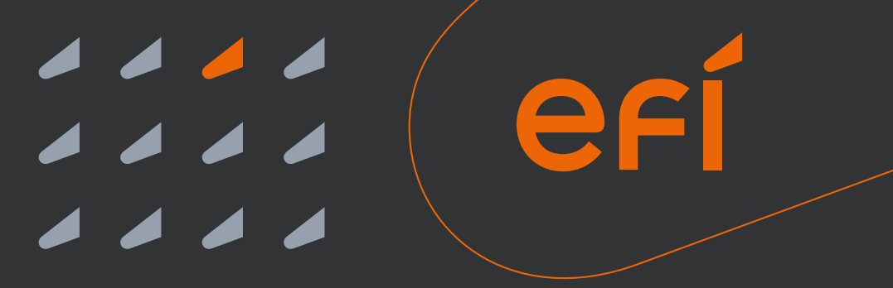
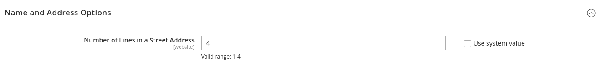
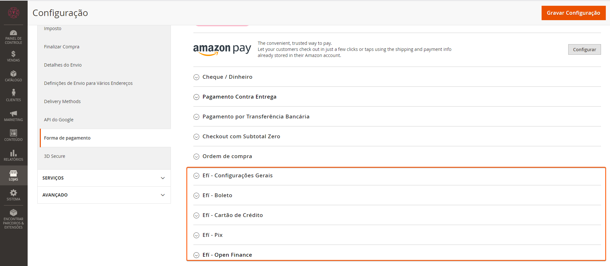
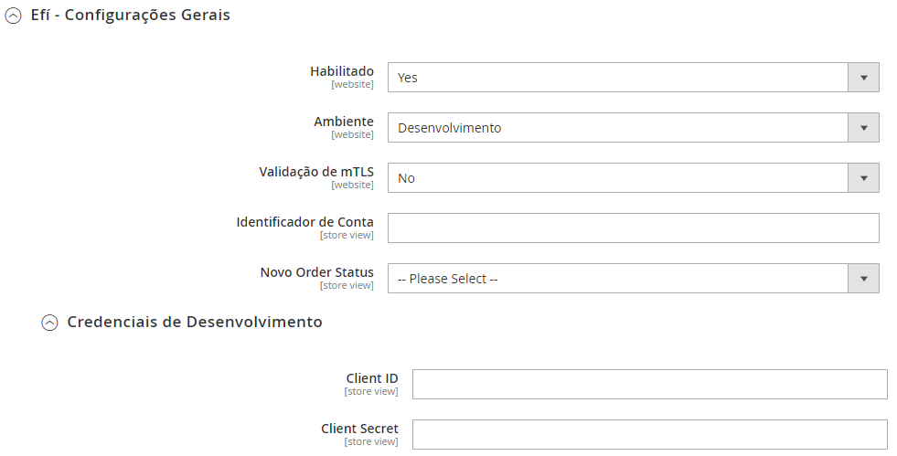
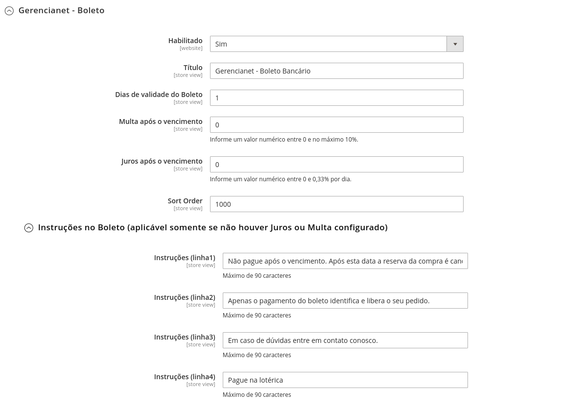
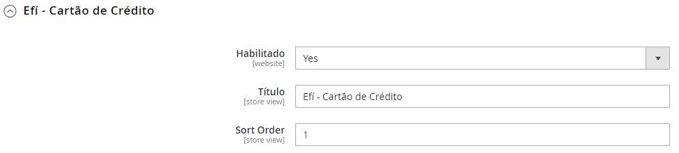
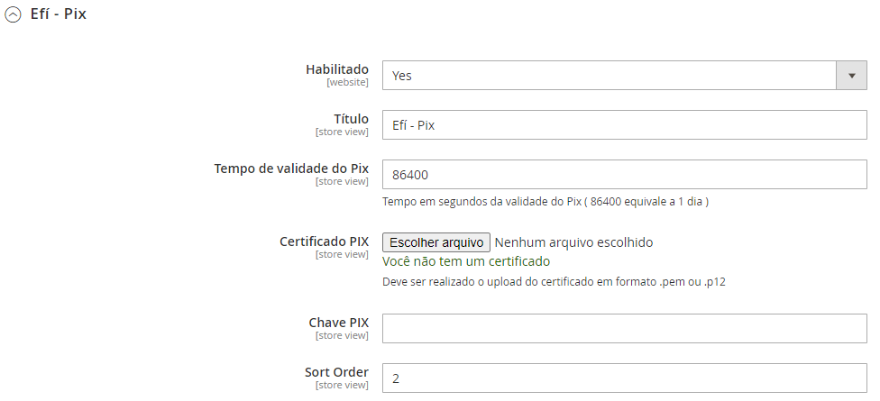
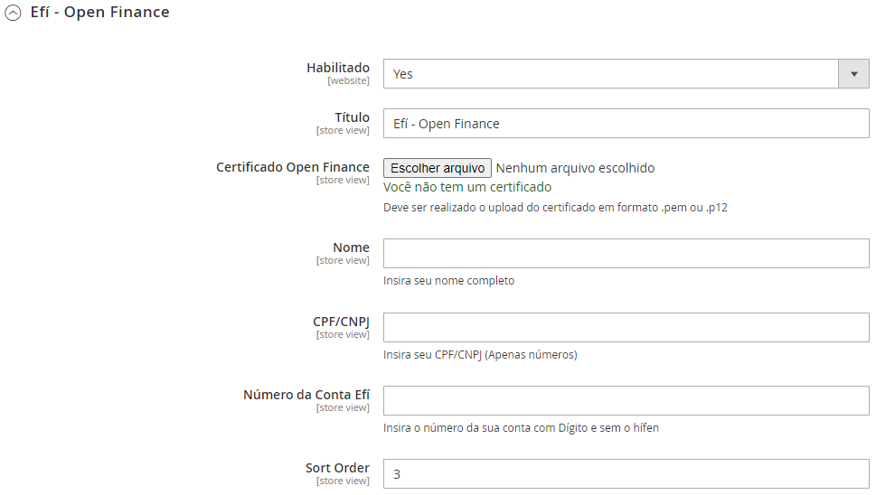

# Efi_Magento2



Módulo de pagamento da Efí, com os métodos de pagamento de Boleto, PIX, Open Finance e Cartão de Crédito.

## Pré requisitos:

- Requer que o PHP esteja no mínimo na versão 8.1.x.
- Requer que o [SDK PHP Gerencianet](https://github.com/gerencianet/gn-api-sdk-php) esteja instalado.

## Versões Compativeis:
- [x] 2.4.4
- [x] 2.4.5
- [x] 2.4.6

# Instalação

> Recomendamos que você possua um ambiente de testes para validar as alterações e atualizações antes de atualiar sua loja em produção. Também que seja feito um **backup** com todas as informações antes de executar qualquer procedimento de atualização/instalação.

## Instalação do Módulo Efí:

- Realize o download do módulo e siga os seguintes passos de acordo com a forma que sua loja foi instalada:

### Instalar usando o Composer

1. Instale via packagist 
   - ```composer require gerencianet/magento2```
   - Neste momento, podem ser solicitadas suas credenciais de autenticação do Magento. Caso tenha alguma dúvida, há uma descrição de como proceder neste [link da documentação oficial](http://devdocs.magento.com/guides/v2.0/install-gde/prereq/connect-auth.html).
2. Execute os comandos:
   - ```bin/magento setup:upgrade```
   - ```bin/magento setup:di:compile```
   - ```bin/magento cache:clean```
   

   ### Instalar usando o github

- Caso sua loja tenha sido criada por meio do clone ou download do projeto magento, siga os seguintes passos:

  1. Extraia o conteúdo do download ZIP e mova o diretório ```\Magento2\``` para dentro da pasta ```Gerencianet``` ;
  2. Verifique se está dessa maneira seus diretórios na sua loja ```app/code/Gerencianet/Magento2```
  3. Habilite o módulo com o seguinte comando, ```bin/magento module:enable Gerencianet_Magento2```
  4. Instale o SDK PHP da Gerencianet utilizando o seguinte comando ```composer require gerencianet/gerencianet-sdk-php:5```
  5. Instale o pacote de log através do comando ```composer require laminas/laminas-log```
  6. Execute o comando ```bin/magento setup:upgrade```
  7. Execute o comando ```bin/magento setup:di:compile```
  8. Execute o comando ```bin/magento cache:clean```
 

# Configurações

Acesse no Painel Administrativo do Magento no menu lateral clique em **Lojas > Configuração > Clientes > Configurações de Cliente > Opções de Nome e Endereço**. Em *Número de Linhas em Endereço* você deve informar o número **4** , conforme imagem abaixo:



**OBS:** No cadastro do usuário, preencher os campos do endereço com rua, número, bairro e complemento, respectivamente.

**Certifique-se também que o campo de telefone esteja obrigatório.**

Após realizar a configuração do Cliente, acesse no Painel Administrativo do Magento No menu lateral clique em `Lojas`, na sequencia clique em `Configuração`, no sub-menu `Vendas` clique em `Formas de Pagamento`. Será carregada a tela para configurar os meios de pagamentos do site.



## Como habilitar a Efí

No primeiro bloco de informação, está a configuração para habilitar ou desabilitar o módulo por completo, marque `Sim` para continuar a configuração. 



Campos: 
 - **Ambiente**: Serve para descrever se as transações 
 - **Identificador da Conta:** Identificador de Conta da Efí
 - **Novo Order Status:** Serve para após a finalização da compra definir o Status do pedido.
 - **Credenciais de Desenvolvimento ou Produção:** Aqui você informa as suas credenciais como o Client Id e Client Secret.

Em seguida temos as configurações de cartão de crédito, configurações de boleto, configurações Open Finance e configurações de pix.

_OBS: Para que todas as configurações a seguir funcionem, todo o passo a passo anterior deve ter sido seguido._

### Boleto 

Nesta sessão você tem as configurações de Boleto.



Campos: 
 - **Habilitado:** Serve para habilitar ou desabilitar a funcionalidade de Boletos.
 - **Título:** Altera o nome do método de pagamento no checkout.
 - **Dias de validade do Boleto:** Validade do Boleto.
 - **Multa após o vencimento:** Valor da multa a ser cobrada após o vencimento.
 - **Juros após o vencimento:** Valor de juros a ser cobrado.
 - **Instruções no boleto:** Aqui você tem quatro campos que podem ser preenchido com mensagens no boleto, desde que as opções de juros e multa estejam zeradas.

### Cartão de Crédito 

Nesta sessão você tem as configurações de cartão de crédito.



Campos: 
 - **Habilitado:** Serve para habilitar ou desabilitar a funcionalidade de cartão de crédito.
 - **Título:** Altera o nome do método de pagamento no checkout.

*OBS: Toda configuração de parcelamento, é realizada através do painel do Efí.*

### Pix 

Nesta sessão você tem as configurações de pix.



Campos: 
 - **Habilitado:** Serve para habilitar ou desabilitar a funcionalidade de Pix.
 - **Título:** Altera o nome do método de pagamento no checkout.
 - **Dias de validade do Pix:** Validade do pix.
 - **Certificado Pix:** Certificado gerado no painel do Efí
 - **Chave Pix:** Sua chave pix cadastrada no aplicativo do Efí


### Open Finance 

Nesta sessão você tem as configurações do Open Finance.



Campos: 
- **Habilitado**: Serve para habilitar ou desabilitar a funcionalidade do Open Finance
- **Título**: Altera o nome do método de pagamento no checkout
- **Certificado Open Finance**: Certificado gerado no painel da Efí
- **Nome**: Nome do titular da conta
- **CPF/CNPJ**: Documento do titular da conta
- **Número da Conta**: Número da conta Efí


